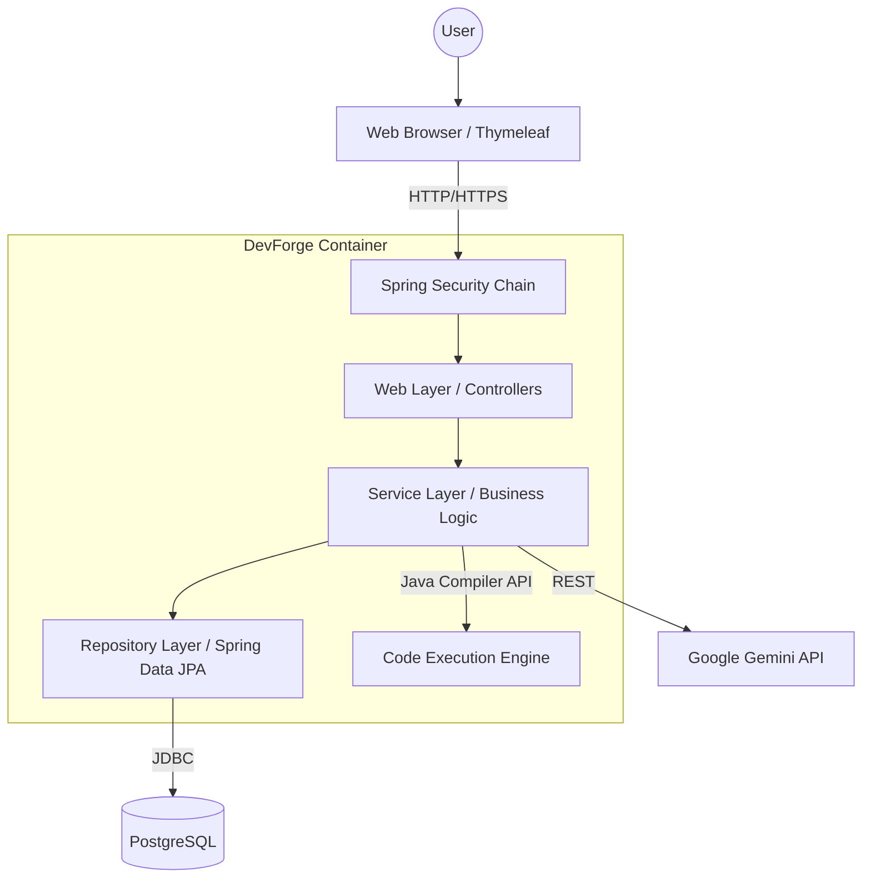
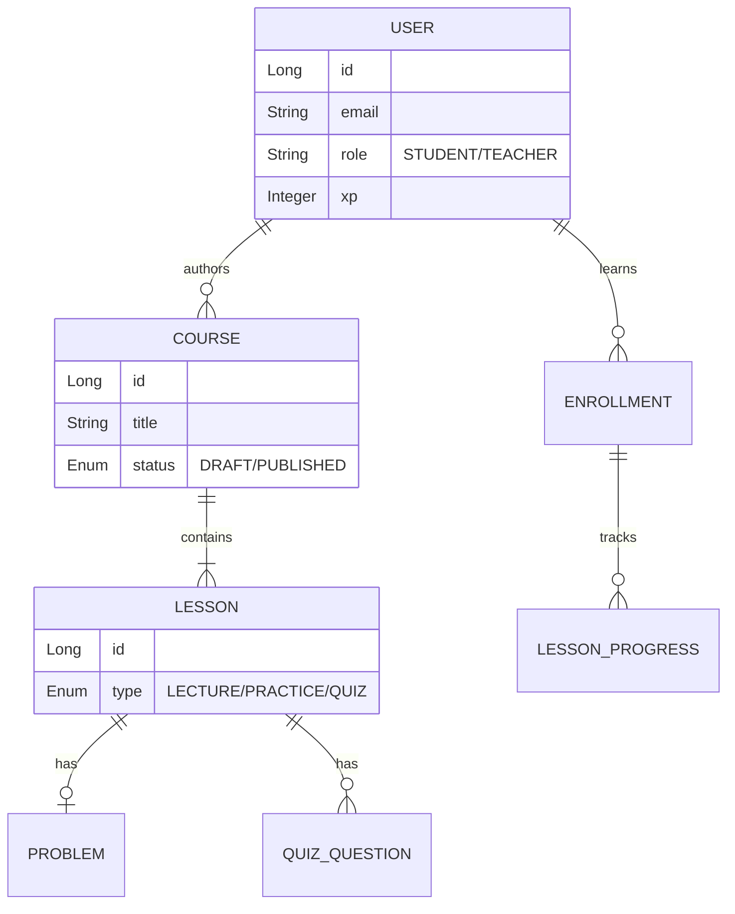

# DevForge Platform 🛠️🎓


**DevForge** is an educational platform designed to teach Algorithms and Data Structures through interactive practice, quizzes, and AI-powered mentorship. The platform bridges the gap between theoretical knowledge and practical application using an in-browser IDE and generative AI.

🔗 **Website:** https://devforge-platform.onrender.com  
📂 **GitHub:** https://github.com/forq-forq/devforge-platform

> **Course Project:** Design Patterns and Architecture  
> **Authors:** Igonin Nikita, Kustaubay Madiyar  
> **Status:** MVP / Prototype

---

## 🏗️ System Architecture

The project follows a **Monolithic Layered Architecture** built with Spring Boot. It emphasizes strong separation of concerns, strict typing, and SOLID principles.

### High-Level Components (C4 Container View)



### 📂 Module Structure

```text
src/main/java/com/devforge/platform
├── common          # Shared utilities & Facade for AI Service
├── course          # LMS Core: Course & Lesson management
├── enrollment      # Progress tracking & Certificate generation
├── practice        # In-memory Code Compilation Engine
├── quiz            # Quiz logic, Grading strategies
├── review          # Rating & Feedback system
├── security        # Auth & Role-Based Access Control
└── user            # User profile, Gamification (Strategy Pattern)
```

---

## 🏛️ Design Patterns Implementation

This project serves as a practical demonstration of GoF (Gang of Four) patterns:

| Pattern | Component | Implementation Details |
| :--- | :--- | :--- |
| **Strategy** | `GamificationService` | Decouples XP calculation logic from the service. Strategies: `LectureXpStrategy`, `QuizXpStrategy`, `PracticeXpStrategy`. |
| **Facade** | `GeminiService` | Encapsulates complex HTTP interaction and prompt engineering with Google Gemini API behind a simple interface. |
| **Builder** | Domain Entities | Utilized via Lombok `@Builder` to enforce immutability and readable object construction. |
| **Adapter** | `JpaRepository` | Spring Data JPA acts as an adapter between Java Objects and SQL queries. |
| **Observer** | `Spring Events` | *(Planned)* Decoupling completion logic from gamification awards. |
| **Singleton** | Service Beans | All services are stateless singletons managed by the Spring IoC Container. |

---

## 💾 Data Model (Simple ER Diagram)

The application uses a normalized relational database schema.



---

## 🔧 Technical Deep Dive

### 1. In-Memory Code Execution Engine
The `CodeExecutionService` allows students to run Java code directly in the browser.
*   **Mechanism:** Uses `javax.tools.JavaCompiler` to compile source code strings into bytecode in RAM (without writing to disk).
*   **Loading:** A custom `ClassLoader` loads the compiled bytecode.
*   **Reflection:** The service uses Java Reflection API to instantiate the student's class and invoke methods against defined `TestCases`.
*   **I/O Interception:** `System.out` is intercepted to capture console logs and display them to the user.

### 2. AI Mentorship (Gemini Integration)
We utilize a Facade pattern to interact with Google's Gemini Pro.
*   **Lecture Summarization:** AI parses Markdown content and extracts key takeaways.
*   **Error Explanation:** If compilation fails, the error stack trace is sent to AI to generate a beginner-friendly hint.
*   **Code Review:** Analyzes student solutions for Clean Code principles (naming conventions, complexity).

### 3. Gamification Strategy
To adhere to the Open-Closed Principle (OCP), the XP award system was refactored from a `switch-case` block to a **Strategy Pattern**.
*   **Interface:** `XpAwardStrategy` defines the contract.
*   **Context:** `GamificationService` injects a Map of strategies (`Map<LessonType, XpAwardStrategy>`).
*   **Extensibility:** Adding a new lesson type (e.g., "Project") only requires creating a new strategy class, without modifying existing code.

---

## ✨ Key Features

*   **👨‍🏫 Course Management:** Full lifecycle support (Drafting, Editing, Publishing).
*   **💻 Interactive IDE:** Monaco Editor integration with syntax highlighting and auto-completion.
*   **🧠 Knowledge Checks:** 
    *   **Quizzes:** Multiple-choice questions.
    *   **Coding Problems:** Unit-test based validation.
*   **🏆 Gamification:** XP system, dynamic ranks (Novice → Grandmaster), and global Leaderboards.
*   **📜 Certificates:** Automatic PDF-ready certificate generation upon 100% completion.
*   **🔐 Security:** BCrypt password hashing, Spring Security, and CSRF protection.

---

## 🛠️ Tech Stack & Dependencies

*   **Core:** Java 21 LTS
*   **Framework:** Spring Boot 3.2.x
*   **Data:** PostgreSQL 15, Spring Data JPA, Hibernate ORM
*   **Frontend:** Thymeleaf (Server-Side Rendering), Bootstrap 5, Javascript
*   **Tools:** Docker Compose, Maven, Lombok
*   **External APIs:** Google Gemini (Generative AI)

---

## 🚀 Getting Started

### Prerequisites
*   **Docker Desktop** (Recommended) OR Java 21 SDK + PostgreSQL installed locally.

### Installation

1.  **Clone the repository:**
    ```bash
    git clone https://github.com/your-repo/devforge.git
    cd devforge
    ```

2.  **Environment Setup:**
    The project uses `docker-compose.yml` with default credentials for development. 
    *   To enable AI features, set your API key in `.env` or `docker-compose.yml`:
    ```yaml
    environment:
      - GEMINI_API_KEY=your_actual_google_api_key
    ```

3.  **Build & Run:**
    ```bash
    docker-compose up --build
    ```
    *The application will start at `http://localhost:8080`*

4.  **Default Accounts:**
    *   👨‍🏫 **Teacher:** `teacher@devforge.com` / `password`
    *   🧑‍💻 **Student:** `student@devforge.com` / `password`

---

## 🔮 Future Roadmap

*   **Microservices Transition:** Decomposing the monolith into services (`AuthService`, `CourseService`, `JudgeService`) for independent scaling.
*   **Sandboxing:** Moving the Code Execution Engine into isolated Docker containers (e.g., via Testcontainers) to prevent RCE vulnerabilities.
*   **Frontend Modernization:** Migrating from Thymeleaf to a SPA framework (React/Next.js) for a more dynamic UX.
*   **CI/CD Pipeline:** Automated testing and deployment to cloud infrastructure.

---

## ⚠️ Known Limitations (MVP)

*   **Security:** Code execution currently runs within the application JVM. Malicious code (e.g., `System.exit(0)`) is not fully sandboxed.
*   **Performance:** Code compilation is synchronous and may block threads under high load.
